##总结
里面有大量的读源码部分 但是笔记中没有 我觉得这个视频真的很好 只不过有点老而已 希望日后还能在刷两遍 

## 1 大纲
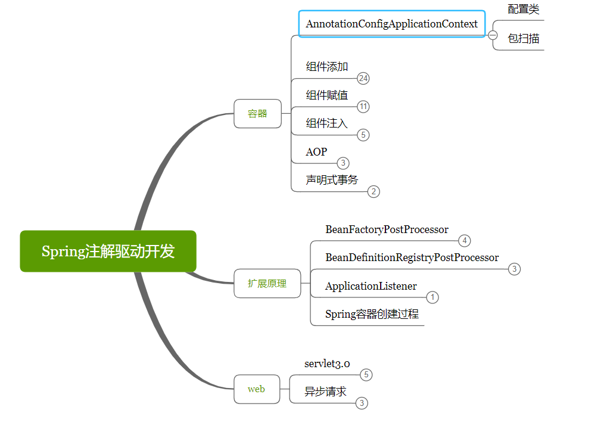

紧急任务 ：记一记专业名词，写的太不专业都是大白话
把里面的单词背一背
Registrar 注册商
Conditional 有条件的

## 容器部分
@Bean是为了解决组件标注注解无法导入第三方jar包的问题
```text，
@Bean注解总结
1、Spring的@Bean注解用于告诉方法，产生一个Bean对象，然后这个Bean对象交给Spring管理。 产生这个Bean对象的方法Spring只会调用一次，随后这个Spring将会将这个Bean对象放在自己的IOC容器中。

2、@Component , @Repository , @ Controller , @Service 这些注解只局限于自己编写的类，而@Bean注解能把第三方库中的类实例加入IOC容器中并交给spring管理。

3、@Bean注解的另一个好处就是能够动态获取一个Bean对象，能够根据环境不同得到不同的Bean对象。

4、、记住，@Bean就放在方法上，就是让方法去产生一个Bean，然后交给Spring容器，剩下的你就别管了。

当然这里并没有讲到@Bean注解的具体细节，只是描述了一个大概，如有其它需求可自行谷歌....

end.....
```

#### 2 @Bean && context.getBeanNamesForType


测试类可以放到test下 设置为 测试期（我说怎么导入junit就是测试期 呢） 不知道使用lib的方式怎么设置 
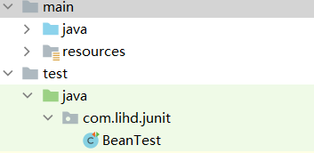 


@给容器注册一个Bean 类型为 返回值类型 ，id默认为方法名 可以通过name属性修改方法名的id
getBeanNamesForType() 可以获取这个类型Bean的所有name 如果只有一个实例 返回的数组就只有一个值

```java
@Configuration
public class BeanConfig {
    //给容器注册一个Bean 类型为 返回值类型 ，id默认为方法名 可以通过name属性修改方法名的id
    @Bean(name = "person001")
    public Person person01(){
        return new Person("张飞",62);
    }
}
```
测试类 
```java
public class BeanTest {
    @Test
    public void testGetBeanByAnnotation() {
        AnnotationConfigApplicationContext context = new AnnotationConfigApplicationContext(BeanConfig.class);
        Person person = context.getBean(Person.class, "person");

        String[] type = context.getBeanNamesForType(Person.class);
        System.out.println(person);

        for (String s : type) {
            System.out.println(s);
        }

    }
}
```


#### 3  @ComponentScan && context.getBeanDefinitionNames

先建立几个包 dao service controller 分别写上对应的类BookDAO... ,具体的代码没有写
其中自动扫描@ComponentScan会扫描下面四个注解 @ComponentScan注解上面也加了 @Component
- dao @Repository
- service @Service
- controller @Controller
- bean @Component

然后使用 @ComponentScan进行配置 主要使用三个属性 basePackages，excludeFilters，includeFilters
需要记住的一点 使用includeFilters时要注意 需要把useDefaultFilters设置为false，否则不生效

```java
/*//排除部分的 组件
@ComponentScan(basePackages = "com.lihd.spring",
        excludeFilters = {@ComponentScan.Filter( type = FilterType.ANNOTATION,classes = {Controller.class, Service.class})}
)*/
@ComponentScan(basePackages = "com.lihd.spring",
        useDefaultFilters = false,
        includeFilters = {@ComponentScan.Filter( type = FilterType.ANNOTATION,classes = {Controller.class, Service.class})}
)
```

test
```java
public class testBean {
    @Test
    public void testComponentScan() {
        AnnotationConfigApplicationContext context = new AnnotationConfigApplicationContext(BeanConfig.class);

        for (String beanDefinitionName : context.getBeanDefinitionNames()) {
            System.out.println(beanDefinitionName);
        }

    }
}
```

结果
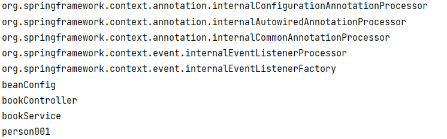

#### 4 @ComponentScan && 其他过滤方式

五种过滤方式 
常用 ：根据注解 ，类名， 自定义
不常用 ：aspectj , 正则表达式
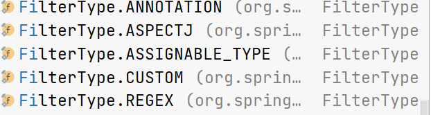

如何使用自定义的方式 
自定义一个类实现 TypeFilter接口 
```java
package com.lihd.spring.controller;
/**
 * @author ：葬花吟留别1851053336@qq.com
 * @description：TODO
 * @date ：2022/4/23 21:11
 */
public class MyTypeFilter implements TypeFilter {


    @Override
    public boolean match(MetadataReader metadataReader, MetadataReaderFactory metadataReaderFactory) throws IOException {

        //获取当前类注解的信息
        AnnotationMetadata annotationMetadata = metadataReader.getAnnotationMetadata();
        //获取当前正在扫描的类信息
        ClassMetadata classMetadata = metadataReader.getClassMetadata();
        //获取当前的类资源 （类路径）
        Resource resource = metadataReader.getResource();


        String className = classMetadata.getClassName();
        System.out.println("className = " + className);


        return className.contains("er");
    }
}

```
配置类上的注解信息
```java
@ComponentScan(basePackages = "com.lihd.spring",
        useDefaultFilters = false,
        includeFilters = {
//                @ComponentScan.Filter( type = FilterType.ANNOTATION,classes = {Controller.class}),
//                @ComponentScan.Filter(type = FilterType.ASSIGNABLE_TYPE,classes = {BookDAO.class}),
                @ComponentScan.Filter(type = FilterType.CUSTOM,classes = {MyTypeFilter.class})
        }
)
@Configuration
```
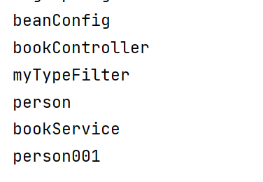

运行结果 ：采用这种方式 即使类上面没有那四种注解 ，也会被扫描到容器中

#### 5@Scope 设置组件的作用域
先说结论
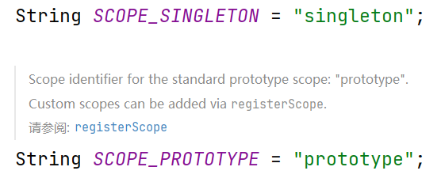
scope分别有四个值 
singleton 单例（默认值）
prototype 多例
request 在web中使用一次请求创建一个对象
session 在web中使用一次会话创建一个对象

他们的加载时机也不同
1 singleton会在 容器初始化时加载
2 prototype 使用前加载

##### 配置类
```java
@Configuration
public class BeanConfig2 {

    @Bean(name = "person")
    public Person getPerson(){
        System.out.println("对象被创建");
        return new Person("李画心",18);
    }

}
```
##### 测试文件
```java
public class BeanClass {
    @Test
    public void testScope() {

        AnnotationConfigApplicationContext context = new AnnotationConfigApplicationContext(BeanConfig2.class);

        System.out.println("容器加载完毕");

        Person person1 = context.getBean(Person.class, "person");
        Person person2 = context.getBean(Person.class, "person");

        System.out.println(person1 == person2);
    }
}
```
##### 运行结果
```text
对象被创建
容器加载完毕
true
```
> 结论 ：默认情况下对象是单例的，并且会在容器加载完成之前实例化

##### 修改
修改 ：在@Bean上添加@Scope
```text
@Scope(value = "prototype")
@Bean(name = "person")
public Person getPerson(){
    System.out.println("对象被创建");
    return new Person("李画心",18);
}
```

##### 再次运行
```java
@Test
    public void testScope(){

        AnnotationConfigApplicationContext context = new AnnotationConfigApplicationContext(BeanConfig2.class);

        System.out.println("容器加载完毕");

        Object person1 = context.getBean("person");
        Object person2 = context.getBean("person");

        System.out.println(person1 == person2);

//        Person person1 = context.getBean(Person.class, "person");
//        Person person2 = context.getBean(Person.class, "person");
//
//        System.out.println(person1 == person2);
    }
```

这里发生了一些错误 （使用注释里的方式会报错）
改成 Object返回值类型就可以 
```text
容器加载完毕
对象被创建
对象被创建
false
```

可以看出 多例容器加载时不会创建对象使用时才会创建
那么单例可以 懒加载吗


#### 6 懒加载
配置类
```java
@Configuration
public class BeanConfig2 {
//    @Scope("prototype")
    @Bean(name = "person")
    @Lazy
    public Person getPerson(){
        System.out.println("对象被创建");
        return new Person("李画心",18);
    }
}
```
结果
```text
容器加载完毕
对象被创建
true
```

#### 7 @Conditional

这个注解在SpringBoot中会经常用到
首先注册多个person对象
可以标注在类上 ，当配置类满足@Conditional条件时才会 才会将@Bean表示返回的对象交给IOC容器管理
```java
@Configuration
public class BeanConfig2 {
//    @Scope("prototype")
    @Bean(name = "person")
    @Lazy
    public Person getPerson(){
        System.out.println("对象被创建");
        return new Person("李画心",18);
    }


    @Conditional({WindowsCondition.class})
    @Bean
    public Person person01(){
        return new Person("Bill Gates",60);
    }


    @Conditional({LinuxCondition.class})
    @Bean Person person02(){
        return new Person("linus",49);
    }

}
```

测试类
这里面新使用了两个方法 都是getBeanXxx比较容易理解 
其中context有一个获取运行时环境的方法 getEnvironment
environment.getProperty("os.name");这个方法可以获取运行时环境的操作系统名称

```java
public class BeanTest {
    @Test
    public void testConditional() {
        AnnotationConfigApplicationContext context = new AnnotationConfigApplicationContext(BeanConfig2.class);


        ConfigurableEnvironment environment = context.getEnvironment();
        String property = environment.getProperty("os.name");
        System.out.println(property);

        String[] beanNamesForType = context.getBeanNamesForType(Person.class);
        for (String s : beanNamesForType) {
            System.out.println(s);
        }


        Map<String, Person> beansOfType = context.getBeansOfType(Person.class);
        System.out.println(beansOfType);


    }
}
```
其中@Conditional注解上的属性是 Conditional数组类型
```java
public class LinuxCondition implements Condition {

    @Override
    public boolean matches(ConditionContext context, AnnotatedTypeMetadata metadata) {
        //1获取BeanFactory
        ConfigurableListableBeanFactory beanFactory = context.getBeanFactory();
        //2 获取类加载器
        ClassLoader classLoader = context.getClassLoader();
        //3获取当前环境
        Environment environment = context.getEnvironment();
        //4 获取Bean定义的注册类
        BeanDefinitionRegistry registry = context.getRegistry();

        String osName = environment.getProperty("os.name");

        if(osName.toLowerCase().contains("linux")){
            return true;
        }
        return false;
    }
}
```

另一个类 WindowsCondition差不多
运行结果
```text
Windows 10
person
person01
对象被创建
{person=Person{name='李画心', id=18}, person01=Person{name='Bill Gates', id=60}}
```


#### 8 使用Import快速导入组件
```text
给容器注册组件
1 包扫描 + 组件标注注解（@Controller,@Service,@Repository,@Component） 局限：只能在自己的项目中使用
2 @Bean 可以导入第三方组件和自身项目中的组件 ，返回值就是类型 方法名就是id 可以使用@Bean(name) 改变 局限：对于方法中没有什么方法体情况比较麻烦
3 @Import 快速导入一个容器中的组件
    1) @Import id默认是全类名
    2) ImportSelector 返回值写上全类名 返回值String[],id也是全类名
    3) ImportBeanDefinitionRegistrar 手动注册bean 可以指定id
4 使用BeanFactory创建对象 实现三个主要的方法
    使用前缀&来表示  要创建的对象是否是BeanFactory
    
```

注解
```text
@Configuration
@Conditional({WindowsCondition.class})
@Import({Blue.class, Green.class})
```
结果
```text
beanConfig2
com.lihd.spring.pojo.Blue
com.lihd.spring.pojo.Green
person
person01
```

#### 8 使用ImportSelector导入组件
在SpringBoot中非常常用

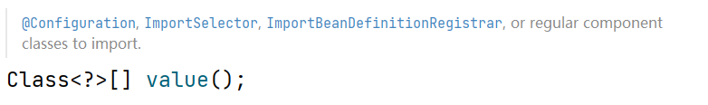
多看源码 多推论 

注解
```text
@Configuration
@Conditional({WindowsCondition.class})
@Import({Blue.class, Green.class, MyImportSelector.class})
```
MyImportSelector
```java
public class MyImportSelector implements ImportSelector {

    //AnnotationMetadata 看见好几次了 这里面就是标注@Import类中所有的注解信息
    @Override
    public String[] selectImports(AnnotationMetadata importingClassMetadata) {
        return new String[]{"com.lihd.spring.pojo.Red"};
    }
}
```

结果
```text
beanConfig2
com.lihd.spring.pojo.Blue
com.lihd.spring.pojo.Green
com.lihd.spring.pojo.Red
person
person01
```

问题 ：为什么 结果中没有 MyImportSelector
是因为 @Import()参数发现类实现了 ImportSelector后 就不会把这个类放入IOC容器。而是把
这个类重写接口中定义方法的返回值作为要注册的组件

#### 10 使用ImportBeanDefinitionRegistrar

注解
```text
@Configuration
@Conditional({WindowsCondition.class})
@Import({Blue.class, Green.class, MyImportSelector.class, MyImportBeanDefinitionRegistrar.class})

```

ImportBeanDefinitionRegistrar实现类
其中要使用到一个BeanDefinition
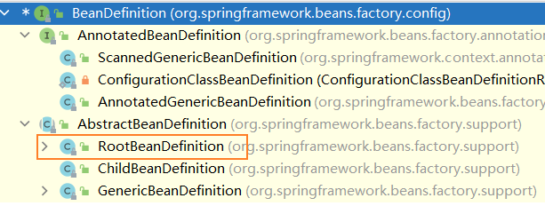


```java
public class MyImportBeanDefinitionRegistrar implements ImportBeanDefinitionRegistrar {
    /*
    AnnotationMetadata importingClassMetadata, 老朋友
    BeanDefinitionRegistry registry 注册类 把要添加的类放入其中
     */

    @Override
    public void registerBeanDefinitions(AnnotationMetadata importingClassMetadata, BeanDefinitionRegistry registry) {

        RootBeanDefinition definition = new RootBeanDefinition(Yellow.class);

        registry.registerBeanDefinition("yellow",definition);
    }
}
```

运行结果
```text
beanConfig2
com.lihd.spring.pojo.Blue
com.lihd.spring.pojo.Green
com.lihd.spring.pojo.Red
person
person01
yellow
```
可以从上面的结果看出这种方式可以指定名称

#### 11 使用BeanFactory创建对象

1 新建一个Color类
2 新建一个ColorFactory类
```java
public class ColorFactory implements FactoryBean<Color> {

    @Override
    public Color getObject() throws Exception {
        return new Color();
    }

    @Override
    public Class<?> getObjectType() {
        return Color.class;
    }

    @Override
    public boolean isSingleton() {
        return false;
    }
}
```
测试类
```text
@Test
    public void testBeanFactory(){
        AnnotationConfigApplicationContext context = new AnnotationConfigApplicationContext(BeanConfig2.class);
        String[] beanDefinitionNames = context.getBeanDefinitionNames();
        for (String s : beanDefinitionNames) {
            System.out.println(s);
        }
        System.out.println("--------------------------------------");
        Object colorFactory = context.getBean("colorFactory");
        System.out.println(colorFactory.getClass().getSimpleName());
    }
```
运行结果
```text
beanConfig2
com.lihd.spring.pojo.Blue
com.lihd.spring.pojo.Green
com.lihd.spring.pojo.Red
person
person01
colorFactory
yellow
--------------------------------------
Color
```
修改代码 Object colorFactory = context.getBean("&colorFactory");
即在getBean的id前面写一个&
运行结果
```text
beanConfig2
com.lihd.spring.pojo.Blue
com.lihd.spring.pojo.Green
com.lihd.spring.pojo.Red
person
person01
colorFactory
yellow
--------------------------------------
ColorFactory
```

由于 isSingleton的返回值可以说明这个对象是否是单例的 当我们设置为false时就是多例 每次获取创建一个
```text
Object colorFactory1 = context.getBean("colorFactory");
        Object colorFactory2 = context.getBean("colorFactory");

        System.out.println(colorFactory1 == colorFactory2)
```
打印结果 是false
当加上前缀&后打印的是true 因为 isSingleton指定的是 BeanFactory::getObject返回值是否是多例的，和自身没有关系


### 生命周期
1 指定初始化方法和销毁方法 @Bean的属性 init-method和destroy-method方法
2 实现InitializingBean（初始化逻辑） 和 DisposableBean（销毁逻辑） 接口
3 使用JSR250规范 @PostConstruct @PreDestroy
(上面的三种方式初始化 ：对象创建完成并且属性值注入完成之后调用，销毁：容器销毁时调用)
4 BeanPostProcessor[interface] :bean后置处理器
在Bean初始化前后进行一些处理工作 对所有类都生效
#### 12 Bean的生命周期 init destroy


bean
```java
public class Car {
    public Car() {
        System.out.println("对象被创建");
    }

    public void init(){
        System.out.println("连接池 线程池的开启工作 代码量很大");
    }

    public void destroy(){
        System.out.println("连接池线程池关闭的操作 否则会导致内存泄露");
    }
}
```

配置类
```java
@Configuration
public class BeanConfigLifeCircle {
    /*
    对于单例对象
    1 创建 :容器初始化时
    2 init:对象创建完成 参数赋值成功后
    3 destroy:容器关闭的时候调用
    对于多例对象
    1 创建 :使用时创建，每次使用都会创建
    2 init：对象创建完成 参数赋值成功后
    3 销毁 ：IOC容器不管理 ，需要手动调用destroy方法
     */
    //@Scope("prototype")
    @Bean(name = "car",initMethod = "init",destroyMethod = "destroy")
    public Car car(){
        return new Car();
    }
}
```
测试代码
```text
    @Test
    public void testInitDestroy(){
        AnnotationConfigApplicationContext context = new AnnotationConfigApplicationContext(BeanConfigLifeCircle.class);

        System.out.println("IOC容器初始化完成");

        Object car1 = context.getBean("car");
        Object car2 = context.getBean("car");

        System.out.println(car1 == car2);

        context.close();
    }
```

运行结果
```text
对象被创建
连接池 线程池的开启工作 代码量很大
IOC容器初始化完成
true
09:27:06.107 [main] DEBUG org.springframework.context.annotation.AnnotationConfigApplicationContext - Closing org.springframework.context.annotation.AnnotationConfigApplicationContext@6e3c1e69, started on Sun Apr 24 09:27:05 CST 2022
连接池线程池关闭的操作 否则会导致内存泄露
```
在配置类修改bean为 scope = prototype后 再次运行
可以看到destroy方法没有被调用 对象相等也是false
```text
IOC容器初始化完成
对象被创建
连接池 线程池的开启工作 代码量很大
对象被创建
连接池 线程池的开启工作 代码量很大
false
09:29:08.615 [main] DEBUG org.springframework.context.annotation.AnnotationConfigApplicationContext - 
Closing org.springframework.context.annotation.AnnotationConfigApplicationContext@6e3c1e69, started on Sun Apr 24 09:29:08 CST 2022
```

#### 13使用 InitializingBean 和 DisposableBean接口实现

```java
@Component
public class Cat implements InitializingBean, DisposableBean {

    public Cat() {
        System.out.println("Cat.Cat");
    }

    @Override
    public void destroy() throws Exception {
        System.out.println("Cat.destroy");
    }

    @Override
    public void afterPropertiesSet() throws Exception {
        System.out.println("Cat.afterPropertiesSet");
    }
}
```
测试代码
```text
@Test
    public void testLife(){
        AnnotationConfigApplicationContext context = new AnnotationConfigApplicationContext(BeanConfigLifeCircle.class);

        System.out.println("--------------");

        context.close();
    }
```
运行结果
```text
Cat.Cat
Cat.afterPropertiesSet
对象被创建
连接池 线程池的开启工作 代码量很大
--------------
连接池线程池关闭的操作 否则会导致内存泄露
Cat.destroy
```
#### 14 使用JSR250规范 @PostConstruct @PreDestroy

```java
@Component
public class Dog {

    public Dog() {
        System.out.println("Dog.Dog");
    }

    @PostConstruct
    public void init(){
        System.out.println("Dog.@PostConstruct");
    }

    @PreDestroy
    public void destroy(){
        System.out.println("Dog.@PreDestroy");
    }

}
```
运行结果
```text
Cat.Cat
Cat.afterPropertiesSet
Dog.Dog
Dog.@PostConstruct
对象被创建
连接池 线程池的开启工作 代码量很大
--------------
连接池线程池关闭的操作 否则会导致内存泄露
Dog.@PreDestroy
Cat.destroy
```

#### 15 使用BeanPostProcessor 接口实现类

实现类
```java
@Component
public class MyBeanPostProcessor implements BeanPostProcessor {
    @Override
    public Object postProcessBeforeInitialization(Object bean, String beanName) throws BeansException {

        System.out.println("bean : "+bean + ", beanName : "+beanName+": MyBeanPostProcessor.postProcessBeforeInitialization");

        return bean;
    }

    @Override
    public Object postProcessAfterInitialization(Object bean, String beanName) throws BeansException {
        System.out.println("bean : "+bean + ", beanName : "+beanName+": MyBeanPostProcessor.postProcessAfterInitialization");

        return bean;
    }
}
```

运行结果
可以看到对对象都生效 甚至spring中的对象 即使没有初始化方法也会执行
```text
Cat.Cat
bean : com.lihd.spring.bean.Cat@433d61fb, beanName : cat: MyBeanPostProcessor.postProcessBeforeInitialization
Cat.afterPropertiesSet
bean : com.lihd.spring.bean.Cat@433d61fb, beanName : cat: MyBeanPostProcessor.postProcessAfterInitialization
Dog.Dog
bean : com.lihd.spring.bean.Dog@1534f01b, beanName : dog: MyBeanPostProcessor.postProcessBeforeInitialization
Dog.@PostConstruct
bean : com.lihd.spring.bean.Dog@1534f01b, beanName : dog: MyBeanPostProcessor.postProcessAfterInitialization
对象被创建
bean : com.lihd.spring.bean.Car@659a969b, beanName : car: MyBeanPostProcessor.postProcessBeforeInitialization
连接池 线程池的开启工作 代码量很大
bean : com.lihd.spring.bean.Car@659a969b, beanName : car: MyBeanPostProcessor.postProcessAfterInitialization
--------------
连接池线程池关闭的操作 否则会导致内存泄露
Dog.@PreDestroy
Cat.destroy

进程已结束,退出代码0

```
#### 16 观察BeanPostProcessor源码
要多练习使用断点
```text
try {
//初始化类的参数
populateBean(beanName, mbd, instanceWrapper);
//执行方法
exposedObject = initializeBean(beanName, exposedObject, mbd);
}
```
initializeBean方法
```text
    Object wrappedBean = bean;
    if (mbd == null || !mbd.isSynthetic()) {
        //执行postProcessBeforeInitialization
        wrappedBean = applyBeanPostProcessorsBeforeInitialization(wrappedBean, beanName);
    }

    try {
        //执行初始化方法
        invokeInitMethods(beanName, wrappedBean, mbd);
    }
    catch (Throwable ex) {
        throw new BeanCreationException(
                (mbd != null ? mbd.getResourceDescription() : null),
                beanName, "Invocation of init method failed", ex);
    }
    if (mbd == null || !mbd.isSynthetic()) {
        //执行postProcessAfterInitialization
        wrappedBean = applyBeanPostProcessorsAfterInitialization(wrappedBean, beanName);
    }

```

applyBeanPostProcessorsBeforeInitialization方法
```java
public abstract class AbstractAutowireCapableBeanFactory {
    @Override
    public Object applyBeanPostProcessorsBeforeInitialization(Object existingBean, String beanName)
            throws BeansException {

        Object result = existingBean;
        for (BeanPostProcessor processor : getBeanPostProcessors()) {
            Object current = processor.postProcessBeforeInitialization(result, beanName);
            if (current == null) {
                return result;
            }
            result = current;
        }
        return result;
    }
}
```

#### 17 BeanPostProcessor

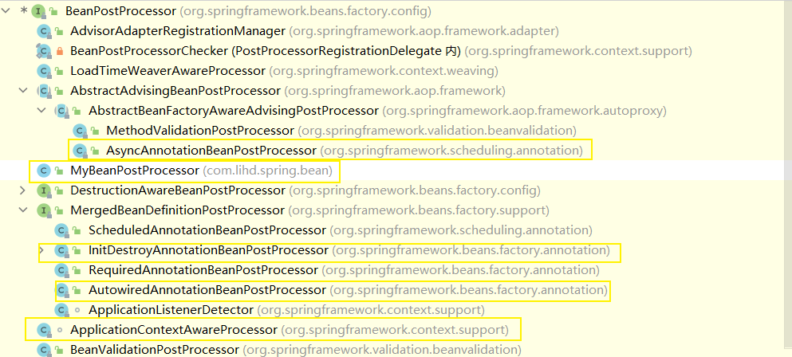

Pig类加入到IOC的过程中用到了 
ApplicationContextAwareProcessor类中的
private void invokeAwareInterfaces(Object bean)


JSR250的实现用到了
InitDestroyAnnotationBeanPostProcessor 


总之就是 这个BeanPostProcessor的实现类会做各种各样得事情


#### 18 19 使用@Value给属性赋值

Bean
```java
public class Person {
    /*
    给属性赋值三种方式
    1 直接写值
    2 使用spEL #{}
    3 使用${} 这种方式需要在配置类上加上类似于 @PropertySource("classpath:person.properties")
     */


    @Value("徐盛")
    private String name;

    @Value("#{42-18}")
    private Integer age;

    @Value("${person.sex}")
    private String sex;

    public Person() {
    }

    public Person(String name, Integer age, String sex) {
        this.name = name;
        this.age = age;
        this.sex = sex;
    }

    public String getName() {
        return name;
    }

    public void setName(String name) {
        this.name = name;
    }

    public Integer getAge() {
        return age;
    }

    public void setAge(Integer age) {
        this.age = age;
    }

    public String getSex() {
        return sex;
    }

    public void setSex(String sex) {
        this.sex = sex;
    }

    @Override
    public String toString() {
        return "Person{" +
                "name='" + name + '\'' +
                ", age=" + age +
                ", sex='" + sex + '\'' +
                '}';
    }
}
```

配置类
也可以在配置文件给属性赋值 类似于下面
context:property-placeholder location=classpath:xxxx.properties

```java
@Configuration
@PropertySource("classpath:person.properties")
public class PropertyValueConfig {
    @Bean
    public Person person(){
        return new Person();
    }
}
```


测试类
可以通过getContext获取运行时环境getEnvironment
这个运行环境中就会有我们配置的值
```java
public class PropertyValueConfigTest {

    @Test
    public void testValue(){
        AnnotationConfigApplicationContext context = new AnnotationConfigApplicationContext(PropertyValueConfig.class);
        Person bean = context.getBean(Person.class);
        System.out.println(bean);
        ConfigurableEnvironment environment = context.getEnvironment();
        String sex = environment.getProperty("person.sex");
        String property = environment.getProperty("os.name");
        System.out.println(sex);
        System.out.println(property);
    }
}

```
运行结果
```text
Person{name='徐盛', age=24, sex='sexyBoy'}
sexyBoy
Windows 10
```
### 自动装配

#### 20 @Autowire

配置类
```java
/**
 * 自动装配 Spring使用依赖注入DI完成对IOC容器中各个组件的依赖关系进行赋值
 * 1@Autowired 自动注入
 *      1.1 默认优先按照类型去容器中找对应的组件
 *      1.2 如果没找到报错 可以通过设置 required = false设置不是必须装配
 *      1.3 如果找到了多个并且有一个设置了优先级@primary：那么使用此对象装配
 *      1.4 如果找到多个且都没有设置优先级 ：根据属性名 查找id为属性名的对象进行赋值
 *      1.5 可以使用在@Autowired 上使用 @Qualifier指定要使用的对象id是什么
 *          会先根据类型查找 再根据id查找 没有找到报错（没有设置required = false）
 *          如果配置了这个 1.3 1.4 规则失效
 *
 *
 * @author ：葬花吟留别1851053336@qq.com
 * @description：TODO
 * @date ：2022/4/24 15:59
 */
@Configuration
@ComponentScan(basePackages = "com.lihd.spring")
public class AutowireConfig {

    @Primary
    @Bean("bookDAO2")
    public BookDAO bookDAO(){
        BookDAO bookDAO = new BookDAO();
        bookDAO.setBookModel("green");
        return bookDAO;
    }
}
```
BookService
```java
@Service
public class BookService {


    @Qualifier("bookDAO")
    @Autowired(required = false)
    private BookDAO bookDAO;

    @Override
    public String toString() {
        return "BookService{" +
                "bookDAO=" + bookDAO +
                '}';
    }
}
```

#### 21 @Resource @Inject
@Resource（JSR250）
可以和@Autowired一样实现自动装配 
不支持@Primary 不支持 required = false

@Inject(JSR330)
需要导入javax.inject的包
支持 @Primary
不支持 required = false 

AutowiredAnnotationBeanPostProcessor 解析完成自动装配功能

#### 22 @Autowire 使用在方法和构造器上
1 使用在set方法上 可以在方法上 也可以在参数加上一个@
2 使用在构造器上 也可以使用在构造器参数上
3 如果只有一个构造器，这个构造器上面的@Autowire可以省略
```java
@Component
public class User {

    //@Autowired
    public User(@Autowired Book book) {
        this.book = book;
    }

    private Book book;

    public Book getBook() {
        return book;
    }


    //@Autowired
    public void setBook(Book book) {
        this.book = book;
    }

    @Override
    public String toString() {
        return "User{" +
                "book=" + book +
                '}';
    }
}

```
在@bean标注的方法上使用@Autowired
参数上的值会从容器中获取，默认不写@Autowired 都能自动装配 
```TEXT
@Bean
public Cart cart(Book book){
    Cart cart = new Cart();
    cart.setBook(book);
    return cart;
}
```
总结 最常用的方式 ：@Bean方法获取IOC容器参数 并且不写@Autowired
#### 23 Aware接口
Aware接口子接口 
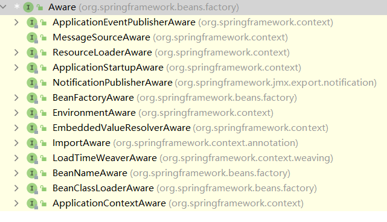

* 4）、自定义组件想要使用Spring容器底层的一些组件（ApplicationContext，BeanFactory，xxx）；
* 		自定义组件实现xxxAware；在创建对象的时候，会调用接口规定的方法注入相关组件；Aware；
* 		把Spring底层一些组件注入到自定义的Bean中；
* 		xxxAware：功能使用xxxProcessor；
* 			ApplicationContextAware==》ApplicationContextAwareProcessor

可以使用断点调试一下 
```java
@Component
public class MyApplicationContextAware implements ApplicationContextAware, BeanNameAware, EnvironmentAware, EmbeddedValueResolverAware {

    //通过 方法回调的方式帮我们注入属性
    @Override
    public void setApplicationContext(ApplicationContext applicationContext) throws BeansException {
        //在这里可以通过
        
    }

    @Override
    public void setBeanName(String name) {
        System.out.println("当前的名字" + name);
    }

    @Override
    public void setEnvironment(Environment environment) {
        System.out.println(environment);
    }

    @Override
    public void setEmbeddedValueResolver(StringValueResolver resolver) {
        String s = resolver.resolveStringValue("你好我是${os.name},我的年龄是#{14+4}");
        System.out.println(s);
    }
}
```

#### 24@Porfile环境搭建
首先去这个网站中查找配置
https://mvnrepository.com/
1 druid连接池
2 mysql驱动
```xml
<!-- https://mvnrepository.com/artifact/com.alibaba/druid -->
        <dependency>
            <groupId>com.alibaba</groupId>
            <artifactId>druid</artifactId>
            <version>1.2.9</version>
        </dependency>

        <!-- https://mvnrepository.com/artifact/mysql/mysql-connector-java -->
        <dependency>
            <groupId>mysql</groupId>
            <artifactId>mysql-connector-java</artifactId>
            <version>8.0.28</version>
        </dependency>
```

2 在resources下新建文件 druid.properties
建议配置文件就这样写 不要直接写 username 因为名字可能冲突
```properties
druid.username=root
druid.password=abc123
druid.driverClassName=com.mysql.jdbc.Driver
druid.jdbcUrl=jdbc:mysql://localhost:13306/
```
3 配置类
需要在这个类上面添加 @PropertySource()
```java
@PropertySource("classpath:/druid.properties")
@Configuration
public class ProfileConfig implements EmbeddedValueResolverAware {

    private StringValueResolver resolver;

    @Value("${druid.username}")
    private String username;

    private String driverClassName;

    @Bean
    public DataSource devDataSource(@Value("${druid.password}")String password) throws Exception {
        Properties properties = new Properties();
        properties.setProperty("username",username);
        properties.setProperty("password",password);
        properties.setProperty("driverClassName",driverClassName);

        String jdbcUrl = resolver.resolveStringValue("${druid.jdbcUrl}");
        String dataBaseName = "jpa";
        properties.setProperty("jdbcUrl",jdbcUrl + dataBaseName);
        DataSource dataSource = DruidDataSourceFactory.createDataSource(properties);
        return dataSource;
    }

    @Bean
    public DataSource testDataSource(@Value("${druid.password}")String password) throws Exception {
        Properties properties = new Properties();
        properties.setProperty("username",username);
        properties.setProperty("password",password);
        properties.setProperty("driverClassName",driverClassName);

        String jdbcUrl = resolver.resolveStringValue("${druid.jdbcUrl}");
        String dataBaseName = "test";
        properties.setProperty("jdbcUrl",jdbcUrl + dataBaseName);
        DataSource dataSource = DruidDataSourceFactory.createDataSource(properties);
        return dataSource;
    }

    @Bean
    public DataSource proDataSource(@Value("${druid.password}")String password) throws Exception {
        Properties properties = new Properties();
        properties.setProperty("username",username);
        properties.setProperty("password",password);
        properties.setProperty("driverClassName",driverClassName);

        String jdbcUrl = resolver.resolveStringValue("${druid.jdbcUrl}");
        String dataBaseName = "dbtest13";
        properties.setProperty("jdbcUrl",jdbcUrl + dataBaseName);
        DataSource dataSource = DruidDataSourceFactory.createDataSource(properties);
        return dataSource;
    }

    @Override
    public void setEmbeddedValueResolver(StringValueResolver resolver) {
        this.resolver = resolver;
        this.driverClassName = resolver.resolveStringValue("${druid.driverClassName}");
    }
}
```
测试类
```text
@Test
public void getAllName(){
    AnnotationConfigApplicationContext context = new AnnotationConfigApplicationContext(ProfileConfig.class);

    for (String s : context.getBeanNamesForType(DataSource.class)) {
        System.out.println(s);
    }
}
```
运行结果
```text
devDataSource
testDataSource
proDataSource
```

#### 25 @profile自动装配
1 在虚拟机环境中添加 -Dxxx
2 使用类 大体如下
AnnotationConfigApplicationContext context = new AnnotationConfigApplicationContext();
context.getEnvironment().setActiveProfiles("test","dev");
context.register(ProfileConfig.class);
context.refresh();
> 可以使用在类上 也可以使用在方法上 

配置类
```java
//@Profile("test")
@PropertySource("classpath:/druid.properties")
@Configuration
public class ProfileConfig implements EmbeddedValueResolverAware {

    private StringValueResolver resolver;

    @Value("${druid.username}")
    private String username;

    private String driverClassName;

    @Bean
    public Book book() {
        return new Book();
    }

    @Profile("dev")
    @Bean
    public DataSource devDataSource(@Value("${druid.password}")String password) throws Exception {
        Properties properties = new Properties();
        properties.setProperty("username",username);
        properties.setProperty("password",password);
        properties.setProperty("driverClassName",driverClassName);

        String jdbcUrl = resolver.resolveStringValue("${druid.jdbcUrl}");
        String dataBaseName = "jpa";
        properties.setProperty("jdbcUrl",jdbcUrl + dataBaseName);
        DataSource dataSource = DruidDataSourceFactory.createDataSource(properties);
        return dataSource;
    }

    @Profile("test")
    @Bean
    public DataSource testDataSource(@Value("${druid.password}")String password) throws Exception {
        Properties properties = new Properties();
        properties.setProperty("username",username);
        properties.setProperty("password",password);
        properties.setProperty("driverClassName",driverClassName);

        String jdbcUrl = resolver.resolveStringValue("${druid.jdbcUrl}");
        String dataBaseName = "test";
        properties.setProperty("jdbcUrl",jdbcUrl + dataBaseName);
        DataSource dataSource = DruidDataSourceFactory.createDataSource(properties);
        return dataSource;
    }

    @Profile("pro")
    @Bean
    public DataSource proDataSource(@Value("${druid.password}")String password) throws Exception {
        Properties properties = new Properties();
        properties.setProperty("username",username);
        properties.setProperty("password",password);
        properties.setProperty("driverClassName",driverClassName);

        String jdbcUrl = resolver.resolveStringValue("${druid.jdbcUrl}");
        String dataBaseName = "dbtest13";
        properties.setProperty("jdbcUrl",jdbcUrl + dataBaseName);
        DataSource dataSource = DruidDataSourceFactory.createDataSource(properties);
        return dataSource;
    }

    @Override
    public void setEmbeddedValueResolver(StringValueResolver resolver) {
        this.resolver = resolver;
        this.driverClassName = resolver.resolveStringValue("${druid.driverClassName}");
    }
}
```

测试类
```text
    @Test
    public void getAllName2(){
        AnnotationConfigApplicationContext context = new AnnotationConfigApplicationContext();

        context.getEnvironment().setActiveProfiles("test","dev");
        context.register(ProfileConfig.class);
        context.refresh();

        for (String s : context.getBeanNamesForType(DataSource.class)) {
            System.out.println(s);
        }

        Book book = context.getBean(Book.class);
        System.out.println(book);
    }
```
运行结果
devDataSource
testDataSource
com.lihd.spring.bean.Book@1623b78d

@Profile可以 在类上面 
只有这个类 满足Profile的环境时 这个配置类中的bean才会被加载到ioc容器中

#### 26 IOC容器
比较重要的注解 
@Conditional
@Import

比这里更重要的是 要学会看文档 英文文档也罢 中文也罢 
自己 写笔记真的是太累了
### AOP

#### 27 AOP回顾 实现自己定义的日志类
```text
* AOP：【动态代理】
* 		指在程序运行期间动态的将某段代码切入到指定方法指定位置进行运行的编程方式；
* 
* 1、导入aop模块；Spring AOP：(spring-aspects)
* 2、定义一个业务逻辑类（MathCalculator）；在业务逻辑运行的时候将日志进行打印（方法之前、方法运行结束、方法出现异常，xxx）
* 3、定义一个日志切面类（LogAspects）：切面类里面的方法需要动态感知MathCalculator.div运行到哪里然后执行；
* 		通知方法：
* 			前置通知(@Before)：logStart：在目标方法(div)运行之前运行
* 			后置通知(@After)：logEnd：在目标方法(div)运行结束之后运行（无论方法正常结束还是异常结束）
* 			返回通知(@AfterReturning)：logReturn：在目标方法(div)正常返回之后运行
* 			异常通知(@AfterThrowing)：logException：在目标方法(div)出现异常以后运行
* 			环绕通知(@Around)：动态代理，手动推进目标方法运行（joinPoint.procced()）
* 4、给切面类的目标方法标注何时何地运行（通知注解）；
* 5、将切面类和业务逻辑类（目标方法所在类）都加入到容器中;
* 6、必须告诉Spring哪个类是切面类(给切面类上加一个注解：@Aspect)
* [7]、给配置类中加 @EnableAspectJAutoProxy 【开启基于注解的aop模式】
* 		在Spring中很多的 @EnableXXX;
* 
* 三步：
* 1）、将业务逻辑组件和切面类都加入到容器中；告诉Spring哪个是切面类（@Aspect）
* 2）、在切面类上的每一个通知方法上标注通知注解，告诉Spring何时何地运行（切入点表达式）
* 3）、开启基于注解的aop模式；@EnableAspectJAutoProxy

```

HelloAop普通的类
```java
public class HelloAop {

    public void sayHello(){
        System.out.println("Hello AOP!");
    }

    public String getStr(String a,Integer b){
        StringBuilder c = new StringBuilder();
        for (int i = 0; i < b; i++) {
            c.append(a);
        }
//        int x = 1/0;
        return c.toString();
    }

}
```

MyLogger
```java
@Aspect //说明是切面类
public class MyLogger {
    SimpleDateFormat simpleDateFormat = new SimpleDateFormat("yyyy-MM-dd hh:mm:ss : ");

    public String getTime(){
        return simpleDateFormat.format(new Date());
    }


    @Pointcut("execution(* com.lihd.spring.aop..*(..))")
    public void pointCut(){
        //空实现即可
    }

    @Before("pointCut()")
    public void before(JoinPoint joinPoint){
        String name = joinPoint.getSignature().getName();
        Object[] args = joinPoint.getArgs();
        System.out.println(getTime() + name + "开始执行 参数为 : " + Arrays.toString(args));
    }

    @After("pointCut()")
    public void after(JoinPoint joinPoint){
        String name = joinPoint.getSignature().getName();
        System.out.println(getTime() + name + "结束执行");
    }

    @AfterThrowing(value = "pointCut()",throwing = "exception")
    public void afterThrowing(JoinPoint joinPoint,Exception exception){
        String name = joinPoint.getSignature().getName();
        System.out.println(getTime() + name + "运行发生异常 异常信息 : " + exception);
    }

    @AfterReturning(value = "pointCut()",returning = "ret")
    public void afterReturning(JoinPoint joinPoint,Object ret){
        String name = joinPoint.getSignature().getName();
        System.out.println(getTime() + name + "结束执行 运行结果 " + ret);
    }

}
```

配置类
```java
@Configuration
@EnableAspectJAutoProxy
public class AOPConfig {

    @Bean
    public HelloAop helloAop(){
        return new HelloAop();
    }

    @Bean
    public MyLogger myLogger(){
        return new MyLogger();
    }

}
```
测试类
```text
    @Test
    public void testAOP(){
        AnnotationConfigApplicationContext context = new AnnotationConfigApplicationContext(AOPConfig.class);

        HelloAop helloAop = context.getBean(HelloAop.class);

        helloAop.getStr("ha",3);
    }
```

运行结果
运行顺序
@Before - 方法 - @AfterReturning - @After
```text
2022-04-25 04:56:01 : getStr开始执行 参数为 : [ha, 3]
2022-04-25 04:56:01 : getStr结束执行 运行结果 hahaha
2022-04-25 04:56:01 : getStr结束执行
```


#### 28 源码分析 观察@EnableAspectJAutoProxy
首先要看一看 @EnableAspectJAutoProxy这个到底是怎么实现自动装配的

下面是他的源码  最重要的是 元注解 @Import(AspectJAutoProxyRegistrar.class)
```java
@Target(ElementType.TYPE)
@Retention(RetentionPolicy.RUNTIME)
@Documented
@Import(AspectJAutoProxyRegistrar.class)
public @interface EnableAspectJAutoProxy {
	/**
	 * Indicate whether subclass-based (CGLIB) proxies are to be created as opposed
	 * to standard Java interface-based proxies. The default is {@code false}.
	 */
	boolean proxyTargetClass() default false;

	/**
	 * Indicate that the proxy should be exposed by the AOP framework as a {@code ThreadLocal}
	 * for retrieval via the {@link org.springframework.aop.framework.AopContext} class.
	 * Off by default, i.e. no guarantees that {@code AopContext} access will work.
	 * @since 4.3.1
	 */
	boolean exposeProxy() default false;

}
```
打开这个注解
这个类只有 一个方法 比较重要的是 
AopConfigUtils.registerAspectJAnnotationAutoProxyCreatorIfNecessary(registry);

这个类会调用 AopConfigUtils中的
return registerOrEscalateApcAsRequired(AnnotationAwareAspectJAutoProxyCreator.class, registry, source);

简而言之 就是注册了一个bean
id = org.springframework.aop.config.internalAutoProxyCreator
class = AnnotationAwareAspectJAutoProxyCreator

ctrl + alt + u观察类图
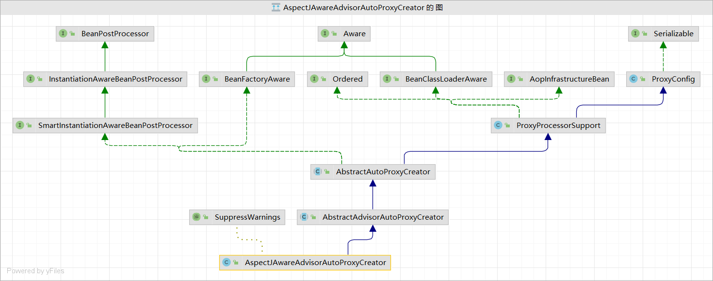

可以看到这个类最终实现了两个接口
1 BeanPostProcessor -> 具有后置处理器的功能 在bean的初始化前后进行一些工作 
2 BeanFactoryAware -> 具有自动装配的功能 自动装配FactoryBean

#### 29-35 aop代理源码分析
```text
 * AOP：【动态代理】
 * 		指在程序运行期间动态的将某段代码切入到指定方法指定位置进行运行的编程方式；
 * 
 * 1、导入aop模块；Spring AOP：(spring-aspects)
 * 2、定义一个业务逻辑类（MathCalculator）；在业务逻辑运行的时候将日志进行打印（方法之前、方法运行结束、方法出现异常，xxx）
 * 3、定义一个日志切面类（LogAspects）：切面类里面的方法需要动态感知MathCalculator.div运行到哪里然后执行；
 * 		通知方法：
 * 			前置通知(@Before)：logStart：在目标方法(div)运行之前运行
 * 			后置通知(@After)：logEnd：在目标方法(div)运行结束之后运行（无论方法正常结束还是异常结束）
 * 			返回通知(@AfterReturning)：logReturn：在目标方法(div)正常返回之后运行
 * 			异常通知(@AfterThrowing)：logException：在目标方法(div)出现异常以后运行
 * 			环绕通知(@Around)：动态代理，手动推进目标方法运行（joinPoint.procced()）
 * 4、给切面类的目标方法标注何时何地运行（通知注解）；
 * 5、将切面类和业务逻辑类（目标方法所在类）都加入到容器中;
 * 6、必须告诉Spring哪个类是切面类(给切面类上加一个注解：@Aspect)
 * [7]、给配置类中加 @EnableAspectJAutoProxy 【开启基于注解的aop模式】
 * 		在Spring中很多的 @EnableXXX;
 * 
 * 三步：
 * 	1）、将业务逻辑组件和切面类都加入到容器中；告诉Spring哪个是切面类（@Aspect）
 * 	2）、在切面类上的每一个通知方法上标注通知注解，告诉Spring何时何地运行（切入点表达式）
 *  3）、开启基于注解的aop模式；@EnableAspectJAutoProxy
 *  
 * AOP原理：【看给容器中注册了什么组件，这个组件什么时候工作，这个组件的功能是什么？】
 * 		@EnableAspectJAutoProxy；
 * 1、@EnableAspectJAutoProxy是什么？
 * 		@Import(AspectJAutoProxyRegistrar.class)：给容器中导入AspectJAutoProxyRegistrar
 * 			利用AspectJAutoProxyRegistrar自定义给容器中注册bean；BeanDefinetion
 * 			internalAutoProxyCreator=AnnotationAwareAspectJAutoProxyCreator
 * 
 * 		给容器中注册一个AnnotationAwareAspectJAutoProxyCreator；
 * 
 * 2、 AnnotationAwareAspectJAutoProxyCreator：
 * 		AnnotationAwareAspectJAutoProxyCreator
 * 			->AspectJAwareAdvisorAutoProxyCreator
 * 				->AbstractAdvisorAutoProxyCreator
 * 					->AbstractAutoProxyCreator
 * 							implements SmartInstantiationAwareBeanPostProcessor, BeanFactoryAware
 * 						关注后置处理器（在bean初始化完成前后做事情）、自动装配BeanFactory
 * 
 * AbstractAutoProxyCreator.setBeanFactory()
 * AbstractAutoProxyCreator.有后置处理器的逻辑；
 * 
 * AbstractAdvisorAutoProxyCreator.setBeanFactory()-》initBeanFactory()
 * 
 * AnnotationAwareAspectJAutoProxyCreator.initBeanFactory()
 *
 *
 * 流程：
 * 		1）、传入配置类，创建ioc容器
 * 		2）、注册配置类，调用refresh（）刷新容器；
 * 		3）、registerBeanPostProcessors(beanFactory);注册bean的后置处理器来方便拦截bean的创建；
 * 			1）、先获取ioc容器已经定义了的需要创建对象的所有BeanPostProcessor
 * 			2）、给容器中加别的BeanPostProcessor
 * 			3）、优先注册实现了PriorityOrdered接口的BeanPostProcessor；
 * 			4）、再给容器中注册实现了Ordered接口的BeanPostProcessor；
 * 			5）、注册没实现优先级接口的BeanPostProcessor；
 * 			6）、注册BeanPostProcessor，实际上就是创建BeanPostProcessor对象，保存在容器中；
 * 				创建internalAutoProxyCreator的BeanPostProcessor【AnnotationAwareAspectJAutoProxyCreator】
 * 				1）、创建Bean的实例
 * 				2）、populateBean；给bean的各种属性赋值
 * 				3）、initializeBean：初始化bean；
 * 						1）、invokeAwareMethods()：处理Aware接口的方法回调
 * 						2）、applyBeanPostProcessorsBeforeInitialization()：应用后置处理器的postProcessBeforeInitialization（）
 * 						3）、invokeInitMethods()；执行自定义的初始化方法
 * 						4）、applyBeanPostProcessorsAfterInitialization()；执行后置处理器的postProcessAfterInitialization（）；
 * 				4）、BeanPostProcessor(AnnotationAwareAspectJAutoProxyCreator)创建成功；--》aspectJAdvisorsBuilder
 * 			7）、把BeanPostProcessor注册到BeanFactory中；
 * 				beanFactory.addBeanPostProcessor(postProcessor);
 * =======以上是创建和注册AnnotationAwareAspectJAutoProxyCreator的过程========
 * 
 * 			AnnotationAwareAspectJAutoProxyCreator => InstantiationAwareBeanPostProcessor
 * 		4）、finishBeanFactoryInitialization(beanFactory);完成BeanFactory初始化工作；创建剩下的单实例bean
 * 			1）、遍历获取容器中所有的Bean，依次创建对象getBean(beanName);
 * 				getBean->doGetBean()->getSingleton()->
 * 			2）、创建bean
 * 				【AnnotationAwareAspectJAutoProxyCreator在所有bean创建之前会有一个拦截，InstantiationAwareBeanPostProcessor，会调用postProcessBeforeInstantiation()】
 * 				1）、先从缓存中获取当前bean，如果能获取到，说明bean是之前被创建过的，直接使用，否则再创建；
 * 					只要创建好的Bean都会被缓存起来
 * 				2）、createBean（）;创建bean；
 * 					AnnotationAwareAspectJAutoProxyCreator 会在任何bean创建之前先尝试返回bean的实例
 * 					【BeanPostProcessor是在Bean对象创建完成初始化前后调用的】
 * 					【InstantiationAwareBeanPostProcessor是在创建Bean实例之前先尝试用后置处理器返回对象的】
 * 					1）、resolveBeforeInstantiation(beanName, mbdToUse);解析BeforeInstantiation
 * 						希望后置处理器在此能返回一个代理对象；如果能返回代理对象就使用，如果不能就继续
 * 						1）、后置处理器先尝试返回对象；
 * 							bean = applyBeanPostProcessorsBeforeInstantiation（）：
 * 								拿到所有后置处理器，如果是InstantiationAwareBeanPostProcessor;
 * 								就执行postProcessBeforeInstantiation
 * 							if (bean != null) {
								bean = applyBeanPostProcessorsAfterInitialization(bean, beanName);
							}
 * 
 * 					2）、doCreateBean(beanName, mbdToUse, args);真正的去创建一个bean实例；和3.6流程一样；
 * 					3）、
 * 			
 * 		
 * AnnotationAwareAspectJAutoProxyCreator【InstantiationAwareBeanPostProcessor】	的作用：
 * 1）、每一个bean创建之前，调用postProcessBeforeInstantiation()；
 * 		关心MathCalculator和LogAspect的创建
 * 		1）、判断当前bean是否在advisedBeans中（保存了所有需要增强bean）
 * 		2）、判断当前bean是否是基础类型的Advice、Pointcut、Advisor、AopInfrastructureBean，
 * 			或者是否是切面（@Aspect）
 * 		3）、是否需要跳过
 * 			1）、获取候选的增强器（切面里面的通知方法）【List<Advisor> candidateAdvisors】
 * 				每一个封装的通知方法的增强器是 InstantiationModelAwarePointcutAdvisor；
 * 				判断每一个增强器是否是 AspectJPointcutAdvisor 类型的；返回true
 * 			2）、永远返回false
 * 
 * 2）、创建对象
 * postProcessAfterInitialization；
 * 		return wrapIfNecessary(bean, beanName, cacheKey);//包装如果需要的情况下
 * 		1）、获取当前bean的所有增强器（通知方法）  Object[]  specificInterceptors
 * 			1、找到候选的所有的增强器（找哪些通知方法是需要切入当前bean方法的）
 * 			2、获取到能在bean使用的增强器。
 * 			3、给增强器排序
 * 		2）、保存当前bean在advisedBeans中；
 * 		3）、如果当前bean需要增强，创建当前bean的代理对象；
 * 			1）、获取所有增强器（通知方法）
 * 			2）、保存到proxyFactory
 * 			3）、创建代理对象：Spring自动决定
 * 				JdkDynamicAopProxy(config);jdk动态代理；
 * 				ObjenesisCglibAopProxy(config);cglib的动态代理；
 * 		4）、给容器中返回当前组件使用cglib增强了的代理对象；
 * 		5）、以后容器中获取到的就是这个组件的代理对象，执行目标方法的时候，代理对象就会执行通知方法的流程；
 * 		
 * 	
 * 	3）、目标方法执行	；
 * 		容器中保存了组件的代理对象（cglib增强后的对象），这个对象里面保存了详细信息（比如增强器，目标对象，xxx）；
 * 		1）、CglibAopProxy.intercept();拦截目标方法的执行
 * 		2）、根据ProxyFactory对象获取将要执行的目标方法拦截器链；
 * 			List<Object> chain = this.advised.getInterceptorsAndDynamicInterceptionAdvice(method, targetClass);
 * 			1）、List<Object> interceptorList保存所有拦截器 5
 * 				一个默认的ExposeInvocationInterceptor 和 4个增强器；
 * 			2）、遍历所有的增强器，将其转为Interceptor；
 * 				registry.getInterceptors(advisor);
 * 			3）、将增强器转为List<MethodInterceptor>；
 * 				如果是MethodInterceptor，直接加入到集合中
 * 				如果不是，使用AdvisorAdapter将增强器转为MethodInterceptor；
 * 				转换完成返回MethodInterceptor数组；
 * 
 * 		3）、如果没有拦截器链，直接执行目标方法;
 * 			拦截器链（每一个通知方法又被包装为方法拦截器，利用MethodInterceptor机制）
 * 		4）、如果有拦截器链，把需要执行的目标对象，目标方法，
 * 			拦截器链等信息传入创建一个 CglibMethodInvocation 对象，
 * 			并调用 Object retVal =  mi.proceed();
 * 		5）、拦截器链的触发过程;
 * 			1)、如果没有拦截器执行执行目标方法，或者拦截器的索引和拦截器数组-1大小一样（指定到了最后一个拦截器）执行目标方法；
 * 			2)、链式获取每一个拦截器，拦截器执行invoke方法，每一个拦截器等待下一个拦截器执行完成返回以后再来执行；
 * 				拦截器链的机制，保证通知方法与目标方法的执行顺序；
 * 		
 * 	总结：
 * 		1）、  @EnableAspectJAutoProxy 开启AOP功能
 * 		2）、 @EnableAspectJAutoProxy 会给容器中注册一个组件 AnnotationAwareAspectJAutoProxyCreator
 * 		3）、AnnotationAwareAspectJAutoProxyCreator是一个后置处理器；
 * 		4）、容器的创建流程：
 * 			1）、registerBeanPostProcessors（）注册后置处理器；创建AnnotationAwareAspectJAutoProxyCreator对象
 * 			2）、finishBeanFactoryInitialization（）初始化剩下的单实例bean
 * 				1）、创建业务逻辑组件和切面组件
 * 				2）、AnnotationAwareAspectJAutoProxyCreator拦截组件的创建过程
 * 				3）、组件创建完之后，判断组件是否需要增强
 * 					是：切面的通知方法，包装成增强器（Advisor）;给业务逻辑组件创建一个代理对象（cglib）；
 * 		5）、执行目标方法：
 * 			1）、代理对象执行目标方法
 * 			2）、CglibAopProxy.intercept()；
 * 				1）、得到目标方法的拦截器链（增强器包装成拦截器MethodInterceptor）
 * 				2）、利用拦截器的链式机制，依次进入每一个拦截器进行执行；
 * 				3）、效果：
 * 					正常执行：前置通知-》目标方法-》后置通知-》返回通知
 * 					出现异常：前置通知-》目标方法-》后置通知-》异常通知
```


#### 37 38 事务环境搭建

配置类
开启事务驱动
配置jdbcTemplate
配置transactionManager
```java
@EnableTransactionManagement
@PropertySource("classpath:/druid.properties")
@ComponentScan(basePackages = "com.lihd.spring")
@Configuration
public class TxConfig {

    @Value("${druid.username}")
    private String username;
    @Value("${druid.password}")
    private String password;
    @Value("${druid.driverClassName}")
    private String driver;
    @Value("${druid.jdbcUrl}")
    private String jdbcUrl;

    @Bean
    public DataSource dataSource(){
        DruidDataSource druidDataSource = new DruidDataSource();
        druidDataSource.setUsername(username);
        druidDataSource.setPassword(password);
        druidDataSource.setUrl(jdbcUrl + "test");
        druidDataSource.setDriverClassName(driver);
        return druidDataSource;
    }

    @Bean
    public JdbcTemplate jdbcTemplate(){
        //这里不会产生多余的dataSource() 是因为Spring会对配置文件进行特殊处理 会把参数注入 但是不会新建对象
        return new JdbcTemplate(dataSource());
    }

    @Bean
    public TransactionManager transactionManager(){
        return new DataSourceTransactionManager(dataSource());
    }

}
```

userDAO
```userDAO
@Repository
public class UserDAO {

    @Autowired
    private JdbcTemplate jdbcTemplate;


    public void addUser(){
        String sql = "insert into user(name,password) values(?,?)";
        String name = UUID.randomUUID().toString().substring(0,5);
        String password = "123456";
        jdbcTemplate.update(sql,name,password);
    }


}
```

userService
```java
@Service
public class UserService {

    @Autowired
    private UserDAO userDAO;

    @Transactional
    public void addUser(){
        userDAO.addUser();
        int i = 1/0;
        userDAO.addUser();
    }

}
```

测试文件
```text
public class TxTest {


    @Test
    public void test01(){
        AnnotationConfigApplicationContext context = new AnnotationConfigApplicationContext(TxConfig.class);

        UserService userService = context.getBean(UserService.class);

        userService.addUser();

    }

}
```
结果 没有一条数据会被插入 
```text
java.lang.ArithmeticException: / by zero
```
##### 事务的原理
```text
 * 声明式事务：
 * 
 * 环境搭建：
 * 1、导入相关依赖
 * 		数据源、数据库驱动、Spring-jdbc模块
 * 2、配置数据源、JdbcTemplate（Spring提供的简化数据库操作的工具）操作数据
 * 3、给方法上标注 @Transactional 表示当前方法是一个事务方法；
 * 4、 @EnableTransactionManagement 开启基于注解的事务管理功能；
 * 		@EnableXXX
 * 5、配置事务管理器来控制事务;
 * 		@Bean
 * 		public PlatformTransactionManager transactionManager()
 * 
 * 
 * 原理：
 * 1）、@EnableTransactionManagement
 * 			利用TransactionManagementConfigurationSelector给容器中会导入组件
 * 			导入两个组件
 * 			AutoProxyRegistrar
 * 			ProxyTransactionManagementConfiguration
 * 2）、AutoProxyRegistrar：
 * 			给容器中注册一个 InfrastructureAdvisorAutoProxyCreator 组件；
 * 			InfrastructureAdvisorAutoProxyCreator：？
 * 			利用后置处理器机制在对象创建以后，包装对象，返回一个代理对象（增强器），代理对象执行方法利用拦截器链进行调用；
 * 
 * 3）、ProxyTransactionManagementConfiguration 做了什么？
 * 			1、给容器中注册事务增强器；
 * 				1）、事务增强器要用事务注解的信息，AnnotationTransactionAttributeSource解析事务注解
 * 				2）、事务拦截器：
 * 					TransactionInterceptor；保存了事务属性信息，事务管理器；
 * 					他是一个 MethodInterceptor；
 * 					在目标方法执行的时候；
 * 						执行拦截器链；
 * 						事务拦截器：
 * 							1）、先获取事务相关的属性
 * 							2）、再获取PlatformTransactionManager，如果事先没有添加指定任何transactionmanger
 * 								最终会从容器中按照类型获取一个PlatformTransactionManager；
 * 							3）、执行目标方法
 * 								如果异常，获取到事务管理器，利用事务管理回滚操作；
 * 								如果正常，利用事务管理器，提交事务
```


### Spring原理


#### 39 BeanFactoryPostProcessor
在Bean的标准初始化之前完成 ：所有的bean的定义信息被加载但是没有初始化
```java
@Component
public class MyBeanFactoryPostProcessor implements BeanFactoryPostProcessor {
    @Override
    public void postProcessBeanFactory(ConfigurableListableBeanFactory beanFactory) throws BeansException {
        System.out.println("MyBeanFactoryPostProcessor.postProcessBeanFactory : " + beanFactory.getBeanDefinitionCount());

    }
}
```

#### 40 BeanDefinitionRegistryPostProcessor
在标准初始化之后修改应用程序上下文的内部 bean 定义注册表。所有常规 bean 定义都将被加载，
但尚未实例化任何 bean。这允许在下一个后处理阶段开始之前添加更多的 bean 定义。
```java
@Component
public class MyBeanDefinitionRegistryPostProcessor implements BeanDefinitionRegistryPostProcessor {
    @Override
    public void postProcessBeanDefinitionRegistry(BeanDefinitionRegistry registry) throws BeansException {
        System.out.println("MyBeanDefinitionRegistryPostProcessor.postProcessBeanDefinitionRegistry : " + registry.getBeanDefinitionCount());

        RootBeanDefinition definition = new RootBeanDefinition(Book.class);

        registry.registerBeanDefinition("book1",definition);

    }

    @Override
    public void postProcessBeanFactory(ConfigurableListableBeanFactory beanFactory) throws BeansException {
        System.out.println("MyBeanDefinitionRegistryPostProcessor.postProcessBeanFactory : " + beanFactory.getBeanDefinitionCount());
    }
}
```

#### 41 42ApplicationListener
ApplicationListener可以监听某个事件event

通过实现这个接口，传入一个泛型事件，在run方法中就可以监听这个事件，从而做出一定的逻辑

比如在等所有bean加载完之后执行某些操作
```java
@Component
public class MyApplicationListener implements ApplicationListener<ApplicationEvent> {
    @Override
    public void onApplicationEvent(ApplicationEvent event) {
        System.out.println("MyApplicationListener监听到 ： " + event);
    }
}

```

#### 43 @EventListener
是 ApplicationListener 的父接口 
```text
背景
在开发工作中，会遇到一种场景，做完某一件事情以后，需要广播一些消息或者通知，告诉其他的模块进行一些事件处理，一般来说，可以一个一个发送请求去通知，但是有一种更好的方式，那就是事件监听，事件监听也是设计模式中 发布-订阅模式、观察者模式的一种实现。

观察者模式：简单的来讲就是你在做事情的时候身边有人在盯着你，当你做的某一件事情是旁边观察的人感兴趣的事情的时候，他会根据这个事情做一些其他的事，但是盯着你看的人必须要到你这里来登记，否则你无法通知到他（或者说他没有资格来盯着你做事情）。

对于 Spring 容器的一些事件，可以监听并且触发相应的方法。通常的方法有 2 种，ApplicationListener 接口和**@EventListener** 注解。

简介
要想顺利的创建监听器，并起作用，这个过程中需要这样几个角色：
1、事件（event）可以封装和传递监听器中要处理的参数，如对象或字符串，并作为监听器中监听的目标。
2、监听器（listener）具体根据事件发生的业务处理模块，这里可以接收处理事件中封装的对象或字符串。
3、事件发布者（publisher）事件发生的触发者。
```

java类
```java
@Component
public class OrdinaryBean {

    @EventListener(classes = ApplicationEvent.class)
    public void listen(ApplicationEvent event){
        System.out.println("一个普通的类 加上@EventListener注解 监听到了 " + event);
    }

}
```
测试类
```java
public class ExtendConfigTest {
    @Test
    public void test01(){
        AnnotationConfigApplicationContext annotationConfigApplicationContext = new AnnotationConfigApplicationContext(ExtendConfig.class);

//        annotationConfigApplicationContext.addApplicationListener(new ApplicationListener<ApplicationEvent>() {
//            @Override
//            public void onApplicationEvent(ApplicationEvent event) {
//
//            }
//        });

        annotationConfigApplicationContext.publishEvent(new ApplicationEvent("我的publishEvent") {

        });

        annotationConfigApplicationContext.close();

    }
}
```
运行结果
```text
0 标准初始化完成 应该是BeanFactory创建初始化好吗？
1 BeanDefinitionRegistryPostProcessor 执行 可以注册bean的定义信息
2 BeanFactoryPostProcessor 在Bean的标准初始化之前完成 即bean的定义信息加载完成之后执行
3 Bean初始化 
4 监听器


```
```text
MyBeanDefinitionRegistryPostProcessor.postProcessBeanDefinitionRegistry : 11
MyBeanDefinitionRegistryPostProcessor.postProcessBeanFactory : 12
MyBeanFactoryPostProcessor.postProcessBeanFactory : 12
Book.Book
Book.Book
MyApplicationListener监听到 ： org.springframework.context.event.ContextRefreshedEvent[source=org.springframework.context.annotation.AnnotationConfigApplicationContext@2f410acf, started on Fri Apr 29 16:58:54 CST 2022]
一个普通的类 加上@EventListener注解 监听到了 org.springframework.context.event.ContextRefreshedEvent[source=org.springframework.context.annotation.AnnotationConfigApplicationContext@2f410acf, started on Fri Apr 29 16:58:54 CST 2022]
MyApplicationListener监听到 ： com.lihd.spring.junit.ExtendConfigTest$1[source=我的publishEvent]
一个普通的类 加上@EventListener注解 监听到了 com.lihd.spring.junit.ExtendConfigTest$1[source=我的publishEvent]
MyApplicationListener监听到 ： org.springframework.context.event.ContextClosedEvent[source=org.springframework.context.annotation.AnnotationConfigApplicationContext@2f410acf, started on Fri Apr 29 16:58:54 CST 2022]
一个普通的类 加上@EventListener注解 监听到了 org.springframework.context.event.ContextClosedEvent[source=org.springframework.context.annotation.AnnotationConfigApplicationContext@2f410acf, started on Fri Apr 29 16:58:54 CST 2022]
```
##### 雷神的总结
```text
 * 扩展原理：
 * BeanPostProcessor：bean后置处理器，bean创建对象初始化前后进行拦截工作的
 * 
 * 1、BeanFactoryPostProcessor：beanFactory的后置处理器；
 * 		在BeanFactory标准初始化之后调用，来定制和修改BeanFactory的内容；
 * 		所有的bean定义已经保存加载到beanFactory，但是bean的实例还未创建
 * 
 * 
 * BeanFactoryPostProcessor原理:
 * 1)、ioc容器创建对象
 * 2)、invokeBeanFactoryPostProcessors(beanFactory);
 * 		如何找到所有的BeanFactoryPostProcessor并执行他们的方法；
 * 			1）、直接在BeanFactory中找到所有类型是BeanFactoryPostProcessor的组件，并执行他们的方法
 * 			2）、在初始化创建其他组件前面执行
 * 
 * 2、BeanDefinitionRegistryPostProcessor extends BeanFactoryPostProcessor
 * 		postProcessBeanDefinitionRegistry();
 * 		在所有bean定义信息将要被加载，bean实例还未创建的；
 * 
 * 		优先于BeanFactoryPostProcessor执行；
 * 		利用BeanDefinitionRegistryPostProcessor给容器中再额外添加一些组件；
 * 
 * 	原理：
 * 		1）、ioc创建对象
 * 		2）、refresh()-》invokeBeanFactoryPostProcessors(beanFactory);
 * 		3）、从容器中获取到所有的BeanDefinitionRegistryPostProcessor组件。
 * 			1、依次触发所有的postProcessBeanDefinitionRegistry()方法
 * 			2、再来触发postProcessBeanFactory()方法BeanFactoryPostProcessor；
 * 
 * 		4）、再来从容器中找到BeanFactoryPostProcessor组件；然后依次触发postProcessBeanFactory()方法
 * 	
 * 3、ApplicationListener：监听容器中发布的事件。事件驱动模型开发；
 * 	  public interface ApplicationListener<E extends ApplicationEvent>
 * 		监听 ApplicationEvent 及其下面的子事件；
 * 
 * 	 步骤：
 * 		1）、写一个监听器（ApplicationListener实现类）来监听某个事件（ApplicationEvent及其子类）
 * 			@EventListener;
 * 			原理：使用EventListenerMethodProcessor处理器来解析方法上的@EventListener；
 * 
 * 		2）、把监听器加入到容器；
 * 		3）、只要容器中有相关事件的发布，我们就能监听到这个事件；
 * 				ContextRefreshedEvent：容器刷新完成（所有bean都完全创建）会发布这个事件；
 * 				ContextClosedEvent：关闭容器会发布这个事件；
 * 		4）、发布一个事件：
 * 				applicationContext.publishEvent()；
 * 	
 *  原理：
 *  	ContextRefreshedEvent、IOCTest_Ext$1[source=我发布的时间]、ContextClosedEvent；
 *  1）、ContextRefreshedEvent事件：
 *  	1）、容器创建对象：refresh()；
 *  	2）、finishRefresh();容器刷新完成会发布ContextRefreshedEvent事件
 *  2）、自己发布事件；
 *  3）、容器关闭会发布ContextClosedEvent；
 *  
 *  【事件发布流程】：
 *  	3）、publishEvent(new ContextRefreshedEvent(this));
 *  			1）、获取事件的多播器（派发器）：getApplicationEventMulticaster()
 *  			2）、multicastEvent派发事件：
 *  			3）、获取到所有的ApplicationListener；
 *  				for (final ApplicationListener<?> listener : getApplicationListeners(event, type)) {
 *  				1）、如果有Executor，可以支持使用Executor进行异步派发；
 *  					Executor executor = getTaskExecutor();
 *  				2）、否则，同步的方式直接执行listener方法；invokeListener(listener, event);
 *  				 拿到listener回调onApplicationEvent方法；
 *  
 *  【事件多播器（派发器）】
 *  	1）、容器创建对象：refresh();
 *  	2）、initApplicationEventMulticaster();初始化ApplicationEventMulticaster；
 *  		1）、先去容器中找有没有id=“applicationEventMulticaster”的组件；
 *  		2）、如果没有this.applicationEventMulticaster = new SimpleApplicationEventMulticaster(beanFactory);
 *  			并且加入到容器中，我们就可以在其他组件要派发事件，自动注入这个applicationEventMulticaster；
 *  
 *  【容器中有哪些监听器】
 *  	1）、容器创建对象：refresh();
 *  	2）、registerListeners();
 *  		从容器中拿到所有的监听器，把他们注册到applicationEventMulticaster中；
 *  		String[] listenerBeanNames = getBeanNamesForType(ApplicationListener.class, true, false);
 *  		//将listener注册到ApplicationEventMulticaster中
 *  		getApplicationEventMulticaster().addApplicationListenerBean(listenerBeanName);
 *  		
 *   SmartInitializingSingleton 原理：->afterSingletonsInstantiated();
 *   		1）、ioc容器创建对象并refresh()；
 *   		2）、finishBeanFactoryInitialization(beanFactory);初始化剩下的单实例bean；
 *   			1）、先创建所有的单实例bean；getBean();
 *   			2）、获取所有创建好的单实例bean，判断是否是SmartInitializingSingleton类型的；
 *   				如果是就调用afterSingletonsInstantiated();
 * 		
 * 
 *
```


#### 44 - 52 Spring创建的原理 

不能根据接口的实现类型进行自动注入 设置默认忽略
```text
Spring容器的refresh()【创建刷新】;
1、prepareRefresh()刷新前的预处理;
	1）、initPropertySources()初始化一些属性设置;子类自定义个性化的属性设置方法；
	2）、getEnvironment().validateRequiredProperties();检验属性的合法等
	3）、earlyApplicationEvents= new LinkedHashSet<ApplicationEvent>();保存容器中的一些早期的事件；
2、obtainFreshBeanFactory();获取BeanFactory；
	1）、refreshBeanFactory();刷新【创建】BeanFactory；
			创建了一个this.beanFactory = new DefaultListableBeanFactory();
			设置id；
	2）、getBeanFactory();返回刚才GenericApplicationContext创建的BeanFactory对象；
	3）、将创建的BeanFactory【DefaultListableBeanFactory】返回；
3、prepareBeanFactory(beanFactory);BeanFactory的预准备工作（BeanFactory进行一些设置）；
	1）、设置BeanFactory的类加载器、支持表达式解析器...
	2）、添加部分BeanPostProcessor【ApplicationContextAwareProcessor】
	3）、设置忽略的自动装配的接口EnvironmentAware、EmbeddedValueResolverAware、xxx；
	4）、注册可以解析的自动装配；我们能直接在任何组件中自动注入：
			BeanFactory、ResourceLoader、ApplicationEventPublisher、ApplicationContext
	5）、添加BeanPostProcessor【ApplicationListenerDetector】
	6）、添加编译时的AspectJ；
	7）、给BeanFactory中注册一些能用的组件；
		environment【ConfigurableEnvironment】、
		systemProperties【Map<String, Object>】、
		systemEnvironment【Map<String, Object>】
4、postProcessBeanFactory(beanFactory);BeanFactory准备工作完成后进行的后置处理工作；
	1）、子类通过重写这个方法来在BeanFactory创建并预准备完成以后做进一步的设置
======================以上是BeanFactory的创建及预准备工作==================================
5、invokeBeanFactoryPostProcessors(beanFactory);执行BeanFactoryPostProcessor的方法；
	BeanFactoryPostProcessor：BeanFactory的后置处理器。在BeanFactory标准初始化之后执行的；
	两个接口：BeanFactoryPostProcessor、BeanDefinitionRegistryPostProcessor
	1）、执行BeanFactoryPostProcessor的方法；
		先执行BeanDefinitionRegistryPostProcessor
		1）、获取所有的BeanDefinitionRegistryPostProcessor；
		2）、看先执行实现了PriorityOrdered优先级接口的BeanDefinitionRegistryPostProcessor、
			postProcessor.postProcessBeanDefinitionRegistry(registry)
		3）、在执行实现了Ordered顺序接口的BeanDefinitionRegistryPostProcessor；
			postProcessor.postProcessBeanDefinitionRegistry(registry)
		4）、最后执行没有实现任何优先级或者是顺序接口的BeanDefinitionRegistryPostProcessors；
			postProcessor.postProcessBeanDefinitionRegistry(registry)
			
		
		再执行BeanFactoryPostProcessor的方法
		1）、获取所有的BeanFactoryPostProcessor
		2）、看先执行实现了PriorityOrdered优先级接口的BeanFactoryPostProcessor、
			postProcessor.postProcessBeanFactory()
		3）、在执行实现了Ordered顺序接口的BeanFactoryPostProcessor；
			postProcessor.postProcessBeanFactory()
		4）、最后执行没有实现任何优先级或者是顺序接口的BeanFactoryPostProcessor；
			postProcessor.postProcessBeanFactory()
6、registerBeanPostProcessors(beanFactory);注册BeanPostProcessor（Bean的后置处理器）【 intercept bean creation】
		不同接口类型的BeanPostProcessor；在Bean创建前后的执行时机是不一样的
		BeanPostProcessor、
		DestructionAwareBeanPostProcessor、
		InstantiationAwareBeanPostProcessor、
		SmartInstantiationAwareBeanPostProcessor、
		MergedBeanDefinitionPostProcessor【internalPostProcessors】、
		
		1）、获取所有的 BeanPostProcessor;后置处理器都默认可以通过PriorityOrdered、Ordered接口来执行优先级
		2）、先注册PriorityOrdered优先级接口的BeanPostProcessor；
			把每一个BeanPostProcessor；添加到BeanFactory中
			beanFactory.addBeanPostProcessor(postProcessor);
		3）、再注册Ordered接口的
		4）、最后注册没有实现任何优先级接口的
		5）、最终注册MergedBeanDefinitionPostProcessor；
		6）、注册一个ApplicationListenerDetector；来在Bean创建完成后检查是否是ApplicationListener，如果是
			applicationContext.addApplicationListener((ApplicationListener<?>) bean);
7、initMessageSource();初始化MessageSource组件（做国际化功能；消息绑定，消息解析）；
		1）、获取BeanFactory
		2）、看容器中是否有id为messageSource的，类型是MessageSource的组件
			如果有赋值给messageSource，如果没有自己创建一个DelegatingMessageSource；
				MessageSource：取出国际化配置文件中的某个key的值；能按照区域信息获取；
		3）、把创建好的MessageSource注册在容器中，以后获取国际化配置文件的值的时候，可以自动注入MessageSource；
			beanFactory.registerSingleton(MESSAGE_SOURCE_BEAN_NAME, this.messageSource);	
			MessageSource.getMessage(String code, Object[] args, String defaultMessage, Locale locale);
8、initApplicationEventMulticaster();初始化事件派发器；
		1）、获取BeanFactory
		2）、从BeanFactory中获取applicationEventMulticaster的ApplicationEventMulticaster；
		3）、如果上一步没有配置；创建一个SimpleApplicationEventMulticaster
		4）、将创建的ApplicationEventMulticaster添加到BeanFactory中，以后其他组件直接自动注入
9、onRefresh();留给子容器（子类）
		1、子类重写这个方法，在容器刷新的时候可以自定义逻辑；
10、registerListeners();给容器中将所有项目里面的ApplicationListener注册进来；
		1、从容器中拿到所有的ApplicationListener
		2、将每个监听器添加到事件派发器中；
			getApplicationEventMulticaster().addApplicationListenerBean(listenerBeanName);
		3、派发之前步骤产生的事件；
11、finishBeanFactoryInitialization(beanFactory);初始化所有剩下的单实例bean；
	1、beanFactory.preInstantiateSingletons();初始化后剩下的单实例bean
		1）、获取容器中的所有Bean，依次进行初始化和创建对象
		2）、获取Bean的定义信息；RootBeanDefinition
		3）、Bean不是抽象的，是单实例的，是懒加载；
			1）、判断是否是FactoryBean；是否是实现FactoryBean接口的Bean；
			2）、不是工厂Bean。利用getBean(beanName);创建对象
				0、getBean(beanName)； ioc.getBean();
				1、doGetBean(name, null, null, false);
				2、先获取缓存中保存的单实例Bean。如果能获取到说明这个Bean之前被创建过（所有创建过的单实例Bean都会被缓存起来）
					从private final Map<String, Object> singletonObjects = new ConcurrentHashMap<String, Object>(256);获取的
				3、缓存中获取不到，开始Bean的创建对象流程；
				4、标记当前bean已经被创建
				5、获取Bean的定义信息；
				6、【获取当前Bean依赖的其他Bean;如果有按照getBean()把依赖的Bean先创建出来；】
				7、启动单实例Bean的创建流程；
					1）、createBean(beanName, mbd, args);
					2）、Object bean = resolveBeforeInstantiation(beanName, mbdToUse);让BeanPostProcessor先拦截返回代理对象；
						【InstantiationAwareBeanPostProcessor】：提前执行；
						先触发：postProcessBeforeInstantiation()；
						如果有返回值：触发postProcessAfterInitialization()；
					3）、如果前面的InstantiationAwareBeanPostProcessor没有返回代理对象；调用4）
					4）、Object beanInstance = doCreateBean(beanName, mbdToUse, args);创建Bean
						 1）、【创建Bean实例】；createBeanInstance(beanName, mbd, args);
						 	利用工厂方法或者对象的构造器创建出Bean实例；
						 2）、applyMergedBeanDefinitionPostProcessors(mbd, beanType, beanName);
						 	调用MergedBeanDefinitionPostProcessor的postProcessMergedBeanDefinition(mbd, beanType, beanName);
						 3）、【Bean属性赋值】populateBean(beanName, mbd, instanceWrapper);
						 	赋值之前：
						 	1）、拿到InstantiationAwareBeanPostProcessor后置处理器；
						 		postProcessAfterInstantiation()；
						 	2）、拿到InstantiationAwareBeanPostProcessor后置处理器；
						 		postProcessPropertyValues()；
						 	=====赋值之前：===
						 	3）、应用Bean属性的值；为属性利用setter方法等进行赋值；
						 		applyPropertyValues(beanName, mbd, bw, pvs);
						 4）、【Bean初始化】initializeBean(beanName, exposedObject, mbd);
						 	1）、【执行Aware接口方法】invokeAwareMethods(beanName, bean);执行xxxAware接口的方法
						 		BeanNameAware\BeanClassLoaderAware\BeanFactoryAware
						 	2）、【执行后置处理器初始化之前】applyBeanPostProcessorsBeforeInitialization(wrappedBean, beanName);
						 		BeanPostProcessor.postProcessBeforeInitialization（）;
						 	3）、【执行初始化方法】invokeInitMethods(beanName, wrappedBean, mbd);
						 		1）、是否是InitializingBean接口的实现；执行接口规定的初始化；
						 		2）、是否自定义初始化方法；
						 	4）、【执行后置处理器初始化之后】applyBeanPostProcessorsAfterInitialization
						 		BeanPostProcessor.postProcessAfterInitialization()；
						 5）、注册Bean的销毁方法；
					5）、将创建的Bean添加到缓存中singletonObjects；
				ioc容器就是这些Map；很多的Map里面保存了单实例Bean，环境信息。。。。；
		所有Bean都利用getBean创建完成以后；
			检查所有的Bean是否是SmartInitializingSingleton接口的；如果是；就执行afterSingletonsInstantiated()；
12、finishRefresh();完成BeanFactory的初始化创建工作；IOC容器就创建完成；
		1）、initLifecycleProcessor();初始化和生命周期有关的后置处理器；LifecycleProcessor
			默认从容器中找是否有lifecycleProcessor的组件【LifecycleProcessor】；如果没有new DefaultLifecycleProcessor();
			加入到容器；
			
			写一个LifecycleProcessor的实现类，可以在BeanFactory
				void onRefresh();
				void onClose();	
		2）、	getLifecycleProcessor().onRefresh();
			拿到前面定义的生命周期处理器（BeanFactory）；回调onRefresh()；
		3）、publishEvent(new ContextRefreshedEvent(this));发布容器刷新完成事件；
		4）、liveBeansView.registerApplicationContext(this);
	
	======总结===========
	1）、Spring容器在启动的时候，先会保存所有注册进来的Bean的定义信息；
		1）、xml注册bean；<bean>
		2）、注解注册Bean；@Service、@Component、@Bean、xxx
	2）、Spring容器会合适的时机创建这些Bean
		1）、用到这个bean的时候；利用getBean创建bean；创建好以后保存在容器中；
		2）、统一创建剩下所有的bean的时候；finishBeanFactoryInitialization()；
	3）、后置处理器；BeanPostProcessor
		1）、每一个bean创建完成，都会使用各种后置处理器进行处理；来增强bean的功能；
			AutowiredAnnotationBeanPostProcessor:处理自动注入
			AnnotationAwareAspectJAutoProxyCreator:来做AOP功能；
			xxx....
			增强的功能注解：
			AsyncAnnotationBeanPostProcessor
			....
	4）、事件驱动模型；
		ApplicationListener；事件监听；
		ApplicationEventMulticaster；事件派发：
```
### Servlet3.0
#### 53 servlet 3.0

An instance of the ServletContainerInitializer is looked up via the jar
services API by the container at container / application startup time. The framework
providing an implementation of the ServletContainerInitializer MUST
bundle in the META-INF/services directory of the jar file a file called
javax.servlet.ServletContainerInitializer, as per the jar services API,
that points to the implementation class of the ServletContainerInitializer.

@HandlesTypes(BookService.class)
public class MyServletContainerInitializer implements ServletContainerInitializer

这个@HandlesTypes会获取所有的BookService 的子类 子接口 或者是 实现类 
运行结果
```text
set = [interface com.lihd.other.SmartBookService, class com.lihd.other.AbstractBookService, class com.lihd.other.AbstractBookServiceImpl]
```

#### 54 ServletContainerInitializer 55 注册三大组件
```text
//容器启动的时候会将@HandlesTypes指定的这个类型下面的子类（实现类，子接口等）传递过来；
//传入感兴趣的类型；
@HandlesTypes(value={HelloService.class})
public class MyServletContainerInitializer implements ServletContainerInitializer {

	/**
	 * 应用启动的时候，会运行onStartup方法；
	 * 
	 * Set<Class<?>> arg0：感兴趣的类型的所有子类型；
	 * ServletContext arg1:代表当前Web应用的ServletContext；一个Web应用一个ServletContext；
	 * 
	 * 1）、使用ServletContext注册Web组件（Servlet、Filter、Listener）
	 * 2）、使用编码的方式，在项目启动的时候给ServletContext里面添加组件；
	 * 		必须在项目启动的时候来添加；
	 * 		1）、ServletContainerInitializer得到的ServletContext；
	 * 		2）、ServletContextListener得到的ServletContext；
	 */
```


结构
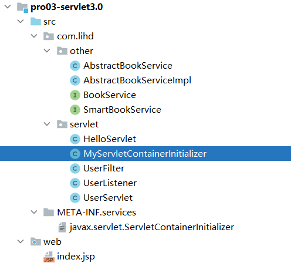

```java
@HandlesTypes(BookService.class)
public class MyServletContainerInitializer implements ServletContainerInitializer {

    @Override
    public void onStartup(Set<Class<?>> set, ServletContext servletContext) throws ServletException {
        System.out.println("set = " + set);

        //注册组件
        ServletRegistration.Dynamic userServlet = servletContext.addServlet("userServlet", new UserServlet());
        userServlet.addMapping("/user");

        FilterRegistration.Dynamic userFilter = servletContext.addFilter("userFilter", UserFilter.class);
        userFilter.addMappingForUrlPatterns(EnumSet.of(DispatcherType.REQUEST),true,"/*");

        servletContext.addListener(UserListener.class);
        
    }
}
```
运行结果
```text
set = [interface com.lihd.other.SmartBookService, class com.lihd.other.AbstractBookService, class com.lihd.other.AbstractBookServiceImpl]
UserListener.contextInitialized
UserFilter.doFilter
UserFilter.doFilter
```

#### 56 57 58 整合SpringMVC
首先细看 
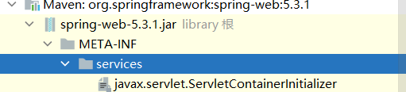
其中的内容
org.springframework.web.SpringServletContainerInitializer

打开这个类
@HandlesTypes(WebApplicationInitializer.class)
public class SpringServletContainerInitializer implements ServletContainerInitializer {
可以看到这个类对 WebApplicationInitializer感兴趣

这个类的实现如下 （那个my是项目中定义的）
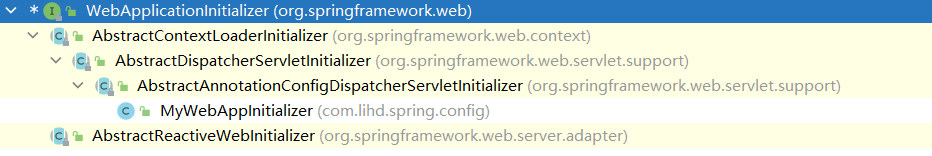
```text
1、web容器在启动的时候，会扫描每个jar包下的META-INF/services/javax.servlet.ServletContainerInitializer
2、加载这个文件指定的类SpringServletContainerInitializer
3、spring的应用一启动会加载感兴趣的WebApplicationInitializer接口的下的所有组件；
4、并且为WebApplicationInitializer组件创建对象（组件不是接口，不是抽象类）
	1）、AbstractContextLoaderInitializer：创建根容器；createRootApplicationContext()；
	2）、AbstractDispatcherServletInitializer：
			创建一个web的ioc容器；createServletApplicationContext();
			创建了DispatcherServlet；createDispatcherServlet()；
			将创建的DispatcherServlet添加到ServletContext中；
				getServletMappings();
	3）、AbstractAnnotationConfigDispatcherServletInitializer：注解方式配置的DispatcherServlet初始化器
			创建根容器：createRootApplicationContext()
					getRootConfigClasses();传入一个配置类
			创建web的ioc容器： createServletApplicationContext();
					获取配置类；getServletConfigClasses();
	
总结：
	以注解方式来启动SpringMVC；继承AbstractAnnotationConfigDispatcherServletInitializer；
实现抽象方法指定DispatcherServlet的配置信息；

===========================
定制SpringMVC；
1）、@EnableWebMvc:开启SpringMVC定制配置功能；
	<mvc:annotation-driven/>；

2）、配置组件（视图解析器、视图映射、静态资源映射、拦截器。。。）
	extends WebMvcConfigurerAdapter
```

配置类
```java
public class MyWebAppInitializer extends AbstractAnnotationConfigDispatcherServletInitializer {
    @Override
    protected Class<?>[] getRootConfigClasses() {
        return new Class[]{RootConfig.class};
    }

    @Override
    protected Class<?>[] getServletConfigClasses() {
        return new Class[]{AppConfig.class};
    }

    @Override
    protected String[] getServletMappings() {
        return new String[]{"/"};
    }
}
```

```java
//不要包含 控制层组件
@Configuration
@ComponentScan(basePackages = "com.lihd.spring",
        excludeFilters ={@ComponentScan.Filter(type = FilterType.ANNOTATION,classes = {Controller.class})}
)
@EnableWebMvc
public class RootConfig{

}
```

```java
//只包含控制层组件即可
@ComponentScan(basePackages = "com.lihd.spring",
        useDefaultFilters = false,
        includeFilters = {@ComponentScan.Filter(type = FilterType.ANNOTATION,classes = Controller.class)}
)
@Configuration
public class AppConfig  implements WebMvcConfigurer {

    //配置拦截器
    @Override
    public void addInterceptors(InterceptorRegistry registry) {
        registry.addInterceptor(new MyInterceptor()).excludePathPatterns("/**");
    }

    //配置默认Servlet
    @Override
    public void configureDefaultServletHandling(DefaultServletHandlerConfigurer configurer) {
        configurer.enable();
    }

    //配置视图解析器
    @Override
    public void configureViewResolvers(ViewResolverRegistry registry) {
        registry.jsp("/WEB-INF/templates/", ".jsp");
    }
}
```
运行结果 ： 正常捏


#### 59 servlet3.0实现
两个主要方法
在注解上开启 asyncSupported = true
req.startAsync();
asyncContext.getResponse();
```java
@WebServlet(value = "/async",asyncSupported = true)
public class AsyncHelloServlet extends HttpServlet {
    @Override
    protected void doGet(HttpServletRequest req, HttpServletResponse resp) throws ServletException, IOException {

        PrintWriter writer = resp.getWriter();
        System.out.println("主线程结束 " + Thread.currentThread().getName() + " : " + System.currentTimeMillis());

        AsyncContext asyncContext = req.startAsync();

        asyncContext.start(new Runnable() {
            @Override
            public void run() {
                System.out.println("异步线程开始 " + Thread.currentThread().getName() + " : " + System.currentTimeMillis());

                try {
                    Thread.sleep(5000);
                    asyncContext.complete();
                    ServletResponse response = asyncContext.getResponse();
                    PrintWriter asyncWriter = response.getWriter();
                    System.out.println("异步线程结束 " + Thread.currentThread().getName() + " : " + System.currentTimeMillis());
                } catch (InterruptedException | IOException e) {
                    e.printStackTrace();
                }
            }
        });
        System.out.println("主线程结束 " + Thread.currentThread().getName() + " : " + System.currentTimeMillis());
        
    }
}
```

#### 60 61 SpringMVC实现异步请求
两种方式 
1 返回 Callable<String> 是两次请求
* 1 控制器返回Callable
* 2、Spring异步处理，将Callable 提交到 TaskExecutor 使用一个隔离的线程进行执行
* 3、DispatcherServlet和所有的Filter退出web容器的线程，但是response 保持打开状态；
* 4、Callable返回结果，SpringMVC将请求重新派发给容器，恢复之前的处理；
* 5、根据Callable返回的结果。SpringMVC继续进行视图渲染流程等（从收请求-视图渲染）。
2 返回 DeferredResult<Object>
```java
@Controller
public class AsyncController {

    @ResponseBody
    @RequestMapping("/async02")
    public DeferredResult<Object> async02(){
        DeferredResult<Object> result = new DeferredResult<>(8000L,"error");

        DeferredResultQueue.add(result);

        return result;
    }


    @ResponseBody
    @RequestMapping("/async03")
    public String addInfo(){
        DeferredResult<Object> result = DeferredResultQueue.get();

        result.setResult("success");
        return "addInfo";
    }


    @ResponseBody
    @RequestMapping("/async")
    public Callable<String> async01(){

        System.out.println("主线程开始 " + Thread.currentThread().getName() + " : " + System.currentTimeMillis());

        Callable<String> stringCallable = new Callable<String>() {
            @Override
            public String  call() throws Exception {
                Thread.sleep(1000);
                System.out.println("副线程结束 " + Thread.currentThread().getName() + " : " + System.currentTimeMillis());
                return "success";
            }
        };
        System.out.println("主线程结束 " + Thread.currentThread().getName() + " : " + System.currentTimeMillis());

        return stringCallable;
    }

}
```

第一种方式的运行结果 其实是两次请求 
```text
主线程开始 http-apr-8080-exec-3 : 1651075078086
主线程结束 http-apr-8080-exec-3 : 1651075078086
23:57:58.086 [http-apr-8080-exec-3] DEBUG org.springframework.web.context.request.async.WebAsyncManager - Started async request
23:57:58.086 [http-apr-8080-exec-3] DEBUG org.springframework.web.servlet.DispatcherServlet - Exiting but response remains open for further handling
副线程结束 MvcAsync2 : 1651075079100
```


